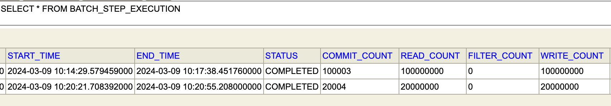

See the [TASK](./TASK.md) file for instructions.

Please document your solution here...

# Approach
After reading the task, I've selected most important features that implementation should have and started 
thinking about most appropriate solution.

I've worked with csv parsing/persisting before using opencsv third party library, so my first implementation
was based on this lib and just making sure positive scenario works on small files.

Next thing to do was making sure implementation can handle huge files, after some searching,
Spring Batch seemed exactly what I need: https://docs.spring.io/spring-batch/reference/spring-batch-intro.html

## Spring Batch

It's primary use case looks like this:
- Reads a large number of records from a database, file, or queue.
- Processes the data in some fashion.
- Writes back data in a modified form.

`Spring Batch automates this basic batch iteration, providing the capability to process similar transactions as a set, typically in an offline environment without any user interaction. Batch jobs are part of most IT projects, and Spring Batch is the only open source framework that provides a robust, enterprise-scale solution.`

Also, Spring Batch documentation covered:
- Scaling and parallel processing scenarios, that is useful for big files: https://docs.spring.io/spring-batch/reference/scalability.html
- other useful things like monitoring and metrics, logging Processing and Failures

# How to run

## Send request

Following request example was launched from project folder

``curl -F data=@src/test/resources/trades20M.csv  --output enrichedTrades.csv --header 'Content-Type: multipart/form-data' -X POST http://localhost:8080/api/v1/enrich``

## Generation new test files

`/script/main.py`

To launch it, simply change in file sample csv file (from where header and other records as trades would be taken)
 and num (how many times the sample file would be duplicated). Then execute following command in terminal:

``python3 src/test/resources/main.py``

## Check Result lines

To double-check the lines of result file, simply run below command in terminal

``cat enrichedTrades.csv | wc -l``

## H2 db

For executing Spring Batch requires some place to store info about jobs, steps and executions.
While project runs, it's possible to access: http://localhost:8080/h2-console
and check out for example BATCH_STEP_EXECUTION schema, where details about how many lines were read, how long it took

## Metrics of execution

Here aare some gathered time metrics for following config:

- chunk size: 1000 
- thread pool core size: 10
- 20 mil records = 3 min 9 seconds
- 100 mil records = 33.5 seconds

